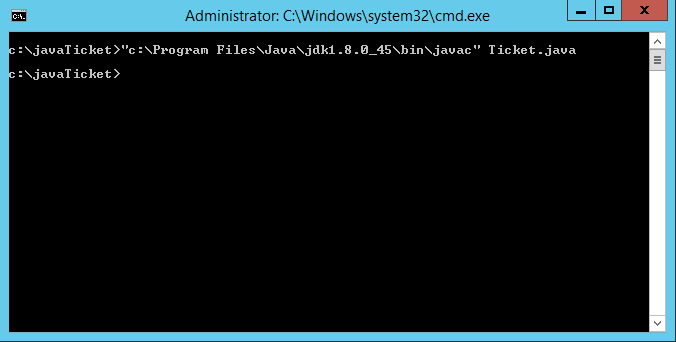
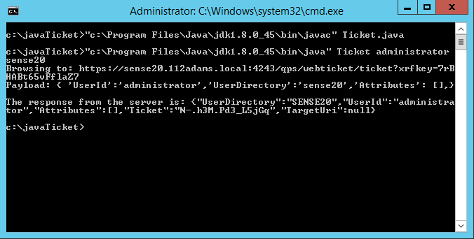

# QlikSenseTicket.java

##Description:
	A simple example of how to request a ticket from Qlik Sense Proxy Service API using java.

##Requirements
	*Java SDK for compiling code - [Download](http://www.oracle.com/technetwork/java/javase/downloads/jdk8-downloads-2133151.html)
	*Text Editor for editing code - Examples: [Notepad++](https://notepad-plus-plus.org/),[SublimeText](http://www.sublimetext.com/2), or an IDE like [Eclipse](https://eclipse.org/downloads/)
	*Certificates placed into a Java keystore for connecting to the QPS API and securing the ticket request. (See below)

##Introduction
	This document goes through the process of creating ticketing code in **Java**.

	###Attention!
		The example described below is an **EXAMPLE**. It is not production code. It is a proof of concept to show how to acquire a ticket from the QPS ReST API using Java. If you are intending to use this code for a production deployment, make sure to do the following:
		*Identify the appropriate certificates to use to connect to the QPS API and to secure communication between Qlik Sense ui and the browser.
		*Identify the context where the ticket request code will be used. One example may be integration with Liferay portals using Apache or Tomcat.

##Qlik Sense Steps
	1. Configure a virtual proxy for ticketing to use with this code. Virtual proxy configuration examples may be found on [QlikCommunity](https://community.qlik.com/docs/DOC-8159).  This documented is applicable to Qlik Sense 2.x as well.
	2. If you are going to use the Qlik Sense provided certificates, export certificates using any hostname so that a client.pfx file is created.

##Java Key Store Steps
	1. Using Java Keytool, create a Java Key Store (JKS) file containing the client.pfx file exported from Qlik Sense.  As a note, I use the word "secret" as the password for my certs.  You may do something different.  Alter the below as necessary.
	```"%PathtoJREKeytool%\keytool.exe" -importkeystore -srckeystore "client.pfx" -srcstoretype pkcs12 -destkeystore "client.jks" -deststoretype JKS -srcstorepass secret -deststorepass secret -noprompt ```

	2. Using Java Keytool, create a Java Key Store (JKS) file containing the root.cer file exported from Qlik Sense.
	```"%PathtoJREKeytool%\keytool.exe" -import -alias QlikCA -keystore "root.jks" -file "root.cer" -storepass secret -noprompt```

##Compiling and Testing the Code
	Compiling the java file into an actual java class is easy to do if the jdk is installed.  Open a command prompt and navigate to the directory with the java code you want to compile.  In the command line type in the path to the javac executable referencing the ticket.java file shown above and hit enter.  If all goes well the code will compile.
	

	Now we can test the code by calling java Ticket with arguments for userId and userDirectory (java class files are case sensitive).
	